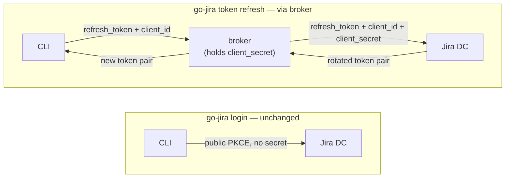

# go-jira

[](https://github.com/appleboy/go-jira/actions/workflows/testing.yml)
[](https://github.com/appleboy/go-jira/actions/workflows/codeql.yml)
[](https://github.com/appleboy/go-jira/actions/workflows/trivy.yml)
[](https://github.com/appleboy/go-jira/actions/workflows/docker.yml)

[English](./README.md) | [繁體中文](./README.zh-tw.md)

整合 [Jira][1] 与 [GitHub][2] 或 [Gitea Action][3] 用于 [JIRA Data Center][4]。

- [Integrating Gitea with Jira Software Development Workflow][01]
- [Gitea 与 Jira 软件开发流程整合][02]

[01]: https://blog.wu-boy.com/2025/01/git-software-development-guide-key-to-improving-team-collaboration-en/
[02]: https://blog.wu-boy.com/2025/03/gitea-integrate-with-jira-issue-tracking-flow-zh-tw/
[1]: https://www.atlassian.com/software/jira
[2]: https://docs.github.com/en/actions
[3]: https://docs.gitea.com/usage/actions/overview
[4]: https://www.atlassian.com/enterprise/data-center/jira

## 目录

- [go-jira](#go-jira)
  - [目录](#目录)
  - [动机](#动机)
  - [安装](#安装)
  - [配置](#配置)
    - [认证](#认证)
    - [环境变量](#环境变量)
    - [使用方法](#使用方法)
      - [转换 Issue 状态并设置解决结果](#转换-issue-状态并设置解决结果)
      - [分配经办人并添加 Markdown 评论](#分配经办人并添加-markdown-评论)
      - [使用 OAuth 登录（本地开发）](#使用-oauth-登录本地开发)
      - [显示版本](#显示版本)
      - [使用自定义环境文件](#使用自定义环境文件)
  - [在 GitHub / Gitea Actions 中使用](#在-github--gitea-actions-中使用)
  - [数据子命令](#数据子命令)
    - [Issue 状态转换](#issue-状态转换)
    - [退出码与错误输出](#退出码与错误输出)
    - [可组合性（管道、静默模式、颜色）](#可组合性管道静默模式颜色)
  - [Schema 自省（供代理使用）](#schema-自省供代理使用)
  - [OAuth 2.0](#oauth-20)
    - [令牌刷新代理（机密客户端）](#令牌刷新代理机密客户端)

## 动机

由于 GitHub Actions 目前没有官方的 Jira API 整合，且考虑到 Jira 同时提供 [Cloud][5] 和 [Data Center][6] 版本，两者具有不同的 API 实现方式，因此本项目将优先专注于 [Data Center][6] API 版本。这将帮助企业版用户通过 CI/CD 自动更新 Jira Issue 状态。

本项目的目标是让 Jira Data Center 能够轻松地与 GitHub 或 Gitea Actions 整合。

> **⚠️ 重要提示**：本项目目前**仅支持 Jira Data Center**。由于两个版本的 API 实现方式不同，目前**不支持 Jira Cloud**。

## 安装

**使用安装脚本（预编译可执行文件）** — 无需 Go 工具链。此脚本会下载对应你
操作系统／架构的最新发行版可执行文件，依照发行版的 `checksums.txt` 校验其
SHA256，并安装到 `~/.go-jira/bin`：

```bash
curl -fsSL https://raw.githubusercontent.com/appleboy/go-jira/main/install.sh | bash
```

可通过环境变量覆盖默认值，例如指定版本或更改安装目录：

```bash
curl -fsSL https://raw.githubusercontent.com/appleboy/go-jira/main/install.sh | VERSION=0.14.1 INSTALL_DIR=/usr/local/bin bash
```

支持平台：macOS（amd64/arm64）、Linux（amd64/arm64/armv5-7）、Windows
（amd64）以及 FreeBSD（amd64）。

查询版本时会调用 GitHub API，未认证请求每个 IP 每小时上限为 60 次。在共享
NAT 环境下可能遇到 `rate limit exceeded`——可设置 `GITHUB_TOKEN` 提高上限，
或指定 `VERSION` 直接跳过查询。

**使用 `go install` 安装**（需 Go 1.25 以上）。可执行文件会放到
`$(go env GOPATH)/bin`，请确认该目录已加入 `PATH`：

```bash
go install github.com/appleboy/go-jira/cmd/go-jira@latest
```

随后即可直接运行：

```bash
go-jira --version
```

**从源码构建：**

```bash
git clone https://github.com/appleboy/go-jira.git
cd go-jira
go install ./cmd/go-jira
```

**使用 Docker 运行** — 已发布镜像位于 `ghcr.io/appleboy/go-jira`，无需安装本地 Go 环境：

```bash
docker run --rm ghcr.io/appleboy/go-jira:latest --version
```

> **备注**：下方使用示例为了方便从源码操作，均以 `go run ./cmd/go-jira`
> 调用工具。若你已通过 `go install` 安装可执行文件，请将示例中的
> `go run ./cmd/go-jira` 替换为 `go-jira`。

## 配置

> **说明**：`go-jira` 通过子命令操作。转换 Issue 状态与发布评论的 Action 行为
> 位于 `go-jira run`，详见下方 [使用方法](#使用方法)。

### 认证

go-jira 支持四种认证模式：

| 模式               | 适用场景                   | 配置方式                              |
| ------------------ | -------------------------- | ------------------------------------- |
| **基本认证**       | 旧版 Jira 或开发/测试      | `JIRA_USERNAME` + `JIRA_PASSWORD`     |
| **Bearer / PAT**   | 推荐的 CI/CD 默认          | `JIRA_TOKEN`（个人访问令牌）          |
| **OAuth（本地）**  | 开发者交互式登录           | `go-jira login`                       |
| **OAuth（CI/CD）** | 需要细粒度权限范围的自动化 | `JIRA_OAUTH_REFRESH_TOKEN` + 轮换处理 |

- **跳过 SSL 验证**：设置 `JIRA_INSECURE=true`（生产环境不建议）

> **OAuth 在 CI/CD 中比 PAT 复杂。** Jira DC 每次刷新都会轮换刷新令牌，
> CI 必须把新令牌写回密钥存储。若无法自动化，建议改用个人访问令牌（`JIRA_TOKEN`）。
> 完整说明见 [docs/oauth-usage.md](docs/oauth-usage.md)。

### 环境变量

| 变量                            | 说明                                                                                       |
| ------------------------------- | ------------------------------------------------------------------------------------------ |
| JIRA_BASE_URL                   | Jira 实例基础地址（如 `https://jira.example.com`）                                         |
| JIRA_USERNAME                   | Jira 用户名（用于基本认证）                                                                |
| JIRA_PASSWORD                   | Jira 密码（用于基本认证）                                                                  |
| JIRA_TOKEN                      | Jira API 令牌（用于令牌认证）                                                              |
| JIRA_INSECURE                   | 设为 `true` 跳过 SSL 证书验证                                                              |
| REF                             | 引用字符串（如 Git 引用/标签/提交信息）                                                    |
| ISSUE_FORMAT                    | 自定义 Issue key 匹配正则（可选）                                                          |
| TRANSITION                      | Issue 要转换到的目标状态名称                                                               |
| RESOLUTION                      | 解决结果名称（如 `Fixed`，可选）                                                           |
| ASSIGNEE                        | 要分配的经办人用户名（可选）                                                               |
| COMMENT                         | 要添加到 Issue 的评论内容（可选）                                                          |
| MARKDOWN                        | 设为 `true` 时将评论从 Markdown 转为 Jira 格式                                             |
| DEBUG                           | 设为 `true` 启用调试输出                                                                   |
| OUTPUT                          | 数据子命令的输出格式：`json`（默认）或 `text`                                              |
| EPIC_FIELD                      | `create`/`update`/`search` 使用的 Epic Link 自定义字段 ID（默认 `customfield_10101`）      |
| SPRINT_FIELD                    | `create`/`update`/`search` 使用的 Sprint 自定义字段 ID（默认 `customfield_10100`）         |
| JIRA_OAUTH_CLIENT_ID            | OAuth client ID（覆盖内嵌默认值）                                                          |
| JIRA_OAUTH_REFRESH_TOKEN        | 注入的刷新令牌；触发 CI `oauth-env` 模式                                                   |
| JIRA_OAUTH_REFRESH_TOKEN_OUTPUT | 写入轮换后刷新令牌的文件路径                                                               |
| JIRA_OAUTH_CALLBACK_PORT        | 本地 OAuth 回调端口（默认 `8765`）                                                         |
| JIRA_OAUTH_CALLBACK_CERT        | HTTPS 登录回调使用的 TLS 证书文件（需同时设置 `JIRA_OAUTH_CALLBACK_KEY`）                  |
| JIRA_OAUTH_CALLBACK_KEY         | HTTPS 登录回调使用的 TLS 密钥文件（需同时设置 `JIRA_OAUTH_CALLBACK_CERT`）                 |
| JIRA_OAUTH_CALLBACK_HTTPS       | 设为 `true`，使用自动生成的内存证书提供 HTTPS 回调（无需证书文件；浏览器会显示一次性警告） |
| JIRA_MASTER_PASSWORD            | 加密文件令牌存储的主密码（无系统密钥环时）                                                 |

`JIRA_BASE_URL` 是本地环境和 `.env` 文件使用的正式名称。`INPUT_BASE_URL` 保留供
GitHub/Gitea Actions 使用。程序不会读取通用的 `BASE_URL`，避免其他应用程序的
设置意外改变 Jira 目标。

### 使用方法

Action 行为在 `run` 子命令下执行。所有动作标志与 GitHub Actions 的 `INPUT_*`
环境变量均由 `go-jira run` 读取。

#### 转换 Issue 状态并设置解决结果

```bash
export JIRA_BASE_URL="https://jira.example.com"
export JIRA_TOKEN="your_api_token"
export TRANSITION="Done"
export RESOLUTION="Fixed"
export REF="refs/tags/v1.0.0"
go run ./cmd/go-jira run
```

#### 分配经办人并添加 Markdown 评论

```bash
export ASSIGNEE="johndoe"
export COMMENT="## 问题已修复\n* 新增测试用例\n* 优化性能"
export MARKDOWN="true"
go run ./cmd/go-jira run
```

#### 使用 OAuth 登录（本地开发）

```bash
export JIRA_BASE_URL="https://jira.example.com"
go run ./cmd/go-jira login --client-id="$JIRA_OAUTH_CLIENT_ID"
# 之后正常执行，会自动使用已存储的令牌：
go run ./cmd/go-jira run --ref="ABC-123" --to-transition=Done
```

#### 显示版本

```bash
go run ./cmd/go-jira --version
```

#### 使用自定义环境文件

```bash
go run ./cmd/go-jira run --env-file=custom.env
```

## 在 GitHub / Gitea Actions 中使用

go-jira 已发布为容器镜像（`ghcr.io/appleboy/go-jira`），工作流可以直接运行它。
下面的示例使用个人访问令牌，将提交信息中找到的每个 Issue key 转换到 `Done`；
这是 CI/CD 最简单的认证方式。

```yaml
name: Update Jira on push
on:
  push:
    branches: [main]

jobs:
  update-jira:
    runs-on: ubuntu-latest
    steps:
      - name: Transition Jira issues
        env:
          JIRA_BASE_URL: https://jira.example.com
          JIRA_TOKEN: ${{ secrets.JIRA_TOKEN }}
        run: |
          docker run --rm -e JIRA_BASE_URL -e JIRA_TOKEN \
            ghcr.io/appleboy/go-jira:latest run \
              --ref="${{ github.event.head_commit.message }}" \
              --to-transition=Done \
              --resolution=Fixed
```

同一个工作流也能在 Gitea Actions 上运行，其语法兼容。若要在 CI/CD 中使用 OAuth
（包括刷新令牌轮换），请参阅完整示例
[`.github/workflows/example-oauth-ci.yml`](.github/workflows/example-oauth-ci.yml)
以及 [docs/oauth-usage.md](docs/oauth-usage.md)。

## 数据子命令

除 `run` 外，go-jira 还提供一组用于脚本与自动化的 Issue/看板子命令。它们与其他
命令共用相同的认证方式（OAuth / Bearer / Basic）、基础 URL 与 `.env` 解析规则，
并默认将机器可读的 JSON 输出到 stdout。传入 `--output text` 可得到简洁、便于阅读的
摘要；错误会写入 stderr 并返回非零退出码（见下文）。

### Issue 状态转换

独立的 `transition` 命令一次处理一个 Issue。请先列出 Jira 当前允许此账号对该
Issue 执行的状态转换，再以 ID 或名称执行其中一项：

```bash
# 列出当前可用的状态转换（默认输出 JSON）
go-jira transition list --key GAIA-123

# 每个状态转换以 ID／名称／目标状态的制表符分隔格式输出一行
go-jira transition list --key GAIA-123 --output text

# 以不区分大小写的完整名称执行
go-jira transition execute --key GAIA-123 --transition Done

# 以完全匹配的状态转换 ID 执行
go-jira transition execute --key GAIA-123 --transition 31

# 执行状态转换时可选择同时设置解决结果
go-jira transition execute --key GAIA-123 --transition Done --resolution Fixed
```

`execute` 每次变更前都会重新获取可用状态转换。完全匹配的 ID 优先；若 ID
不匹配，选择器必须以不区分大小写的方式完整匹配状态转换名称。找不到时不会
发送变更请求；若多个状态转换同名，命令会报告名称有歧义，并要求改用 ID。

两个子命令都支持 `--output json|text`。`list` 的默认 JSON 包含 Issue `key` 与
`transitions` 数组；每项数据会提供 `id`、`name`、目标状态（`to`），以及 Jira
返回的状态转换字段元数据（`fields`）。文本格式则每行输出
`ID<TAB>NAME<TAB>DESTINATION_STATUS`。成功的 `execute` JSON 会报告
`status: "transitioned"`、Issue key、所选状态转换的 ID、名称与目标状态；文本
格式会输出例如 `transitioned GAIA-123 via 31 (Done) -> Done` 的单行结果。只有 Jira
接受状态转换后才会输出成功结果。`--resolution` 是唯一支持的额外状态转换屏幕字段。

现有的 `go-jira run --to-transition` 仍可从自由文本提取多个 Issue key，并保留原有
以名称执行批量状态转换的行为。

### 退出码与错误输出

每个命令会依照错误类别返回不同的退出码，让脚本与代理无需解析 stderr 即可分支处理：

| 退出码 | 含义                              |
| ------ | --------------------------------- |
| `0`    | 成功                              |
| `1`    | 一般运行时错误                    |
| `2`    | 用法错误（错误的标志或参数）      |
| `3`    | 认证/授权失败（HTTP `401`/`403`） |
| `4`    | 触发速率限制（HTTP `429`）        |

失败时会向 **stderr** 写入单一的结构化 JSON 对象。速率限制与认证失败会包含 HTTP
状态码；速率限制失败也会提供服务器的 `Retry-After` 提示（请求不会自动重试）：

```json
{
  "error": {
    "kind": "rate_limit",
    "message": "error searching issues: 429 Too Many Requests",
    "exit_code": 4,
    "status_code": 429,
    "retry_after": "30"
  }
}
```

| 命令                 | 用途                               | 主要标志                                                                                                                  |
| -------------------- | ---------------------------------- | ------------------------------------------------------------------------------------------------------------------------- |
| `search`             | 执行 JQL 查询                      | `--jql`（必填）、`--fields`、`--limit`                                                                                    |
| `get`                | 获取单个 Issue 的摘要与状态        | `--key`（必填）                                                                                                           |
| `create`             | 创建 Task 类型的 Issue             | `--project`、`--summary`（必填）、`--assignee`、`--description`、`--components`、`--labels`、`--epic`、`--sprint`         |
| `update`             | 部分更新 Issue 字段                | `--key`（必填）以及 `--summary`、`--description`、`--assignee`、`--components`、`--labels`、`--epic`、`--sprint` 中任意项 |
| `sprints`            | 列出看板的 Sprint（Agile API）     | `--board-id`（必填）、`--state`、`--limit`                                                                                |
| `epics`              | 列出看板中活跃的 Epic（Agile API） | `--board-id`（必填）、`--limit`                                                                                           |
| `boards`             | 查找项目的看板（Agile API）        | `--project`（必填）、`--type`、`--limit`                                                                                  |
| `link`               | 关联两个 Issue                     | `--from`、`--to`（必填）、`--link-type`                                                                                   |
| `transition list`    | 列出单个 Issue 可用的状态转换      | `--key`（必填）、`--output`                                                                                               |
| `transition execute` | 按 ID 或名称转换单个 Issue         | `--key`（必填）、`--transition`（必填）、`--resolution`、`--output`                                                       |

### 可组合性（管道、静默模式、颜色）

go-jira 设计上可直接嵌入 Shell 管道与代理工具链：

- **stdout 与 stderr 分离** — 结果输出到 **stdout**，所有诊断信息输出到
  **stderr**，因此 `go-jira search ... > issues.json` 只会捕获 JSON。
- **`--quiet` / `-q`** — 隐藏 stderr 上的信息性日志（`authenticated`、
  `user account` 等行），只保留警告、错误与结果。为全局标志，适用于所有子命令。
- **`--no-color` / `NO_COLOR`** — 禁用 stderr 日志的 ANSI 颜色。当 stderr 不是
  终端时也会自动禁用（遵循 [no-color.org](https://no-color.org)）。
- **`--timeout`** — 限制单次操作的执行时间，例如 `--timeout 30s` 或
  `--timeout 2m`，让代理能设定时间预算。`0`（默认值）会使用各命令的
  默认超时。所有与 Jira 通信的子命令均支持。
- **控制字符防护** — 含有控制字符（ASCII < `0x20`，但允许 tab／换行／回车）的
  参数会在任何命令执行前被拒绝并返回退出码 `2`，以防止终端转义序列与日志注入。
- **stdin 输入** — 自由文本标志 `--ref`、`--comment`、`--description`、`--jql`
  均可传入 `-` 从 stdin 读取其值：

```bash
# 将最新一条提交信息传给 run 命令
git log -1 --format=%B | go-jira run --ref - --to-transition Done

# 将 Markdown 内容通过管道作为新 Issue 的描述
cat body.md | go-jira create --project GAIA --summary "New bug" --description -

# 静默模式，仅输出机器可读内容以便脚本处理
go-jira --quiet search --jql "project = GAIA" > issues.json
```

```bash
export JIRA_BASE_URL="https://jira.example.com"
export JIRA_TOKEN="your_personal_access_token"

# 搜索（JSON 输出到 stdout）
go run ./cmd/go-jira search --jql "project = GAIA AND status = Open" --limit 10

# 便于阅读的摘要
go run ./cmd/go-jira get --key GAIA-123 --output text

# 创建 Task，并将其关联到 Epic 与 Sprint
go run ./cmd/go-jira create --project GAIA --summary "Investigate flaky test" \
  --epic GAIA-42 --sprint 55 --labels ci,flaky

# 部分更新——只修改传入标志所指定的字段
go run ./cmd/go-jira update --key GAIA-123 \
  --summary "Reworded title" --assignee jdoe --labels triaged

# 列出看板中活跃的 Epic
go run ./cmd/go-jira epics --board-id 10381

# 关联两个 Issue
go run ./cmd/go-jira link --from GAIA-1 --to GAIA-2 --link-type Blocks
```

不同 Jira 实例的 Epic Link 与 Sprint 自定义字段 ID 可能不同。默认值分别为
`customfield_10101` / `customfield_10100`；可通过 `--epic-field` / `--sprint-field`
（或 `EPIC_FIELD` / `SPRINT_FIELD`）覆盖。

## Schema 自省（供代理使用）

`go-jira schema` 会打印完整的命令与标志树，让代理（或脚本）无需抓取
`--help` 即可探索整个 CLI 接口。使用 `--output json` 获取机器可读的描述；
该 JSON 也包含构建的 `version` 与 `commit`：

```bash
# 机器可读的命令／标志 schema，含构建元数据
go-jira schema --output json

# 人类可读、列出每个命令及其标志的树状结构
go-jira schema --output text
```

如需快速查看构建摘要，`go-jira version` 会输出版本、提交、Go 版本与平台（默认便于
阅读；添加 `--output json` 可获得机器可读格式）。`schema` 仍用于自省完整的命令/标志
接口，而 `--version` 会刻意只输出单一的 semver 字符串。

```bash
# 便于阅读的构建信息（版本、提交、Go 版本、平台）
go-jira version

# 机器可读的构建信息
go-jira version --output json
```

## OAuth 2.0

go-jira 通过 Authorization Code + PKCE 流程支持 Jira Data Center 的 OAuth 2.0
提供方，可用于本地登录，也支持为 CI/CD 注入刷新令牌。

子命令：

- `go-jira login` — 在浏览器中交互式登录；将令牌存入操作系统密钥环（若没有可用的
  密钥环，则存入 AES-256-GCM 加密文件）。
- `go-jira logout` — 删除指定站点已存储的令牌。
- `go-jira whoami` — 显示已认证的用户与当前认证模式。
- `go-jira token status|refresh|print` — 检查或刷新已存储的令牌。
- `go-jira broker serve` — 为机密客户端运行令牌刷新代理（在服务端保存
  `client_secret`；见下文）。
- `go-jira config show` — 显示解析后的配置，以及每个值的来源。

### 令牌刷新代理（机密客户端）

**为什么需要代理。** go-jira 以**公共 PKCE 客户端**的形式发布：登录不需要密钥，
因此公开发布的可执行文件中不会包含密钥。但某些 Jira Data Center OAuth 应用会注册为
**机密客户端**，此时 Jira DC 在 `grant_type=refresh_token` 步骤中**要求提供
`client_secret`**（登录仍无需密钥，只有刷新会被拒绝）。公开发布的可执行文件绝不能
内嵌这个密钥——任何人都能对它运行 `strings` 并读取密钥。令牌刷新代理解决了这一
问题：它在**服务端**保存 `client_secret`，代替 CLI 将其加入上游刷新请求，因此密钥
永远不会到达客户端。

设置 `JIRA_TOKEN_BROKER_URL` 后，go-jira 会**只将刷新步骤**交给
`go-jira broker serve`。**登录流程不会改变**——仍是直接连接 Jira 的公共 PKCE 流程，不使用密钥；
未设置该环境变量时，行为与现在**完全相同**（直接刷新），CLI 也**永远不会**持有密钥。



代理**不会**存储令牌，并会将同一个刷新令牌的并发刷新合并为一次上游调用（Jira DC
每次刷新都会使旧刷新令牌失效，因此直接并发调用会发生竞态）。它只从运行环境读取
密钥，例如由 Vault 提供给 Kubernetes Secret。请以**同一个可执行文件**运行
`go-jira broker serve`，并将其置于仅限内部访问且启用 TLS 的入口之后；网络是主要的
访问控制，也可以通过调用方 Bearer 令牌（`JIRA_BROKER_TOKEN`）提供纵深防御。有关
k8s + Vault 部署、请求合并时序图、环境变量契约与完整安全模型，请参阅指南中的
[令牌刷新代理章节](docs/oauth-usage.md#6-token-refresh-broker-confidential-clients)。

完整设置说明请参阅 **[docs/oauth-usage.md](docs/oauth-usage.md)**，其中包括在 Jira 中
注册客户端、权限范围、存储后端、CI/CD 刷新令牌轮换以及令牌刷新代理。

[5]: https://developer.atlassian.com/cloud/jira/platform/
[6]: https://developer.atlassian.com/server/jira/platform/
