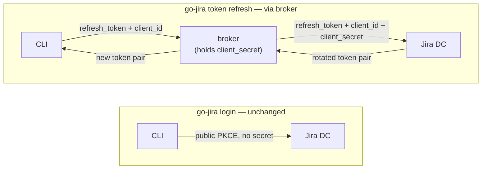

# go-jira

[](https://github.com/appleboy/go-jira/actions/workflows/testing.yml)
[](https://github.com/appleboy/go-jira/actions/workflows/codeql.yml)
[](https://github.com/appleboy/go-jira/actions/workflows/trivy.yml)
[](https://github.com/appleboy/go-jira/actions/workflows/docker.yml)

[English](./README.md) | [簡體中文](./README.zh-cn.md)

整合 [Jira][1] 與 [GitHub][2] 或 [Gitea Action][3] 用於 [JIRA Data Center][4]。

- [Integrating Gitea with Jira Software Development Workflow][01]
- [Gitea 與 Jira 軟體開發流程整合][02]

[01]: https://blog.wu-boy.com/2025/01/git-software-development-guide-key-to-improving-team-collaboration-en/
[02]: https://blog.wu-boy.com/2025/03/gitea-integrate-with-jira-issue-tracking-flow-zh-tw/
[1]: https://www.atlassian.com/software/jira
[2]: https://docs.github.com/en/actions
[3]: https://docs.gitea.com/usage/actions/overview
[4]: https://www.atlassian.com/enterprise/data-center/jira

## 目錄

- [go-jira](#go-jira)
  - [目錄](#目錄)
  - [動機](#動機)
  - [安裝](#安裝)
  - [設定說明](#設定說明)
    - [認證方式](#認證方式)
    - [環境變數](#環境變數)
    - [使用範例](#使用範例)
      - [轉移 Issue 狀態並設定解決方案](#轉移-issue-狀態並設定解決方案)
      - [分配處理人並新增 Markdown 評論](#分配處理人並新增-markdown-評論)
      - [使用 OAuth 登入（本機開發）](#使用-oauth-登入本機開發)
      - [顯示版本](#顯示版本)
      - [使用自訂環境檔](#使用自訂環境檔)
  - [在 GitHub / Gitea Actions 中使用](#在-github--gitea-actions-中使用)
  - [資料子命令](#資料子命令)
    - [Issue 狀態轉移](#issue-狀態轉移)
    - [結束碼與錯誤輸出](#結束碼與錯誤輸出)
    - [可組合性（管線、安靜模式、色彩）](#可組合性管線安靜模式色彩)
  - [Schema 自我描述（供代理程式使用）](#schema-自我描述供代理程式使用)
  - [OAuth 2.0](#oauth-20)
    - [權杖更新代理（confidential clients）](#權杖更新代理confidential-clients)

## 動機

由於 GitHub Actions 目前沒有官方的 Jira API 整合，且考慮到 Jira 同時提供 [Cloud][5] 和 [Data Center][6] 版本，兩者具有不同的 API 實作方式，因此本專案將優先專注於 [Data Center][6] API 版本。這將幫助企業版用戶透過 CI/CD 自動更新 Jira Issue 狀態。

本專案的目標是讓 Jira Data Center 能夠輕鬆地與 GitHub 或 Gitea Actions 整合。

> **⚠️ 重要提醒**：本專案目前**僅支援 Jira Data Center**。由於兩個版本的 API 實作方式不同，目前**不支援 Jira Cloud**。

## 安裝

**使用安裝腳本（預編譯執行檔）** — 不需要 Go 工具鏈。此腳本會下載對應你
作業系統／架構的最新發行版執行檔，依照發行版的 `checksums.txt` 驗證其
SHA256，並安裝到 `~/.go-jira/bin`：

```bash
curl -fsSL https://raw.githubusercontent.com/appleboy/go-jira/main/install.sh | bash
```

可透過環境變數覆寫預設值，例如指定版本或變更安裝目錄：

```bash
curl -fsSL https://raw.githubusercontent.com/appleboy/go-jira/main/install.sh | VERSION=0.15.0 INSTALL_DIR=/usr/local/bin bash
```

支援平台：macOS（amd64/arm64）、Linux（amd64/arm64/armv5-7）、Windows
（amd64）以及 FreeBSD（amd64）。

查詢版本時會呼叫 GitHub API，未認證請求每個 IP 每小時上限為 60 次。在共用
NAT 環境下可能遇到 `rate limit exceeded`——可設定 `GITHUB_TOKEN` 提高上限，
或指定 `VERSION` 直接跳過查詢。

**使用 `go install` 安裝**（需 Go 1.25 以上）。執行檔會放到
`$(go env GOPATH)/bin`，請確認該目錄已加入 `PATH`：

```bash
go install github.com/appleboy/go-jira/cmd/go-jira@latest
```

接著即可直接執行：

```bash
go-jira --version
```

**從原始碼建置：**

```bash
git clone https://github.com/appleboy/go-jira.git
cd go-jira
go install ./cmd/go-jira
```

**使用 Docker 執行** — 已發佈映像檔位於 `ghcr.io/appleboy/go-jira`，無需安裝本機 Go 環境：

```bash
docker run --rm ghcr.io/appleboy/go-jira:latest --version
```

> **備註**：下方使用範例為了方便從原始碼操作，皆以 `go run ./cmd/go-jira`
> 呼叫工具。若你已透過 `go install` 安裝執行檔，請將範例中的
> `go run ./cmd/go-jira` 改為 `go-jira`。

## 設定說明

> **說明**：`go-jira` 透過子命令操作。轉移 issue 狀態與張貼評論的 Action 行為
> 位於 `go-jira run`，詳見下方 [使用範例](#使用範例)。

### 認證方式

go-jira 支援四種認證模式：

| 模式               | 適用場景                  | 設定方式                              |
| ------------------ | ------------------------- | ------------------------------------- |
| **基本認證**       | 舊版 Jira 或開發/測試     | `JIRA_USERNAME` + `JIRA_PASSWORD`     |
| **Bearer / PAT**   | 建議的 CI/CD 預設         | `JIRA_TOKEN`（個人存取權杖）          |
| **OAuth（本機）**  | 開發者互動式登入          | `go-jira login`                       |
| **OAuth（CI/CD）** | 需要細粒度 scope 的自動化 | `JIRA_OAUTH_REFRESH_TOKEN` + 輪換處理 |

- **跳過 SSL 驗證**：設定 `JIRA_INSECURE=true`（不建議於正式環境）

> **OAuth 在 CI/CD 比 PAT 麻煩。** Jira DC 每次更新都會輪換 refresh token，
> CI 必須把新的 refresh token 寫回機密資料儲存區。若無法自動化，建議改用
> PAT（`JIRA_TOKEN`）。
> 完整說明見 [docs/oauth-usage.md](docs/oauth-usage.md)。

### 環境變數

| 變數                            | 說明                                                                                         |
| ------------------------------- | -------------------------------------------------------------------------------------------- |
| JIRA_BASE_URL                   | Jira 實例基礎網址（如 `https://jira.example.com`）                                           |
| JIRA_USERNAME                   | Jira 使用者名稱（用於基本認證）                                                              |
| JIRA_PASSWORD                   | Jira 密碼（用於基本認證）                                                                    |
| JIRA_TOKEN                      | Jira API 權杖（用於權杖認證）                                                                |
| JIRA_INSECURE                   | 設為 `true` 跳過 SSL 憑證驗證                                                                |
| REF                             | 參考字串（如 git ref/tag/commit message）                                                    |
| ISSUE_FORMAT                    | 自訂 Issue key 比對正規表示式（可選）                                                        |
| TRANSITION                      | Issue 狀態轉移的目標狀態名稱                                                                 |
| RESOLUTION                      | 解決方案名稱（如 `Fixed`，可選）                                                             |
| ASSIGNEE                        | 要指派 Issue 的使用者名稱（可選）                                                            |
| COMMENT                         | 要新增至 Issue 的評論內容（可選）                                                            |
| MARKDOWN                        | 設為 `true` 時將評論從 Markdown 轉為 Jira 格式                                               |
| DEBUG                           | 設為 `true` 啟用除錯輸出                                                                     |
| OUTPUT                          | 資料子命令的輸出格式：`json`（預設）或 `text`                                                |
| EPIC_FIELD                      | `create`／`update`／`search` 使用的 Epic Link 自訂欄位 ID（預設 `customfield_10101`）        |
| SPRINT_FIELD                    | `create`／`update`／`search` 使用的 Sprint 自訂欄位 ID（預設 `customfield_10100`）           |
| JIRA_OAUTH_CLIENT_ID            | OAuth client ID（覆寫內嵌預設值）                                                            |
| JIRA_OAUTH_REFRESH_TOKEN        | 注入的 refresh token；觸發 CI `oauth-env` 模式                                               |
| JIRA_OAUTH_REFRESH_TOKEN_OUTPUT | 寫入輪換後 refresh token 的檔案路徑                                                          |
| JIRA_OAUTH_CALLBACK_PORT        | 本機 OAuth 回呼連接埠（預設 `8765`）                                                         |
| JIRA_OAUTH_CALLBACK_CERT        | HTTPS 登入回呼使用的 TLS 憑證檔案（須搭配 `JIRA_OAUTH_CALLBACK_KEY`）                        |
| JIRA_OAUTH_CALLBACK_KEY         | HTTPS 登入回呼使用的 TLS 私鑰檔案（須搭配 `JIRA_OAUTH_CALLBACK_CERT`）                       |
| JIRA_OAUTH_CALLBACK_HTTPS       | 設為 `true`，以自動產生的記憶體內憑證提供 HTTPS 回呼（不需憑證檔案；瀏覽器會顯示一次性警告） |
| JIRA_MASTER_PASSWORD            | 加密檔案權杖儲存區的主密碼（無可用的作業系統鑰匙圈時）                                       |

`JIRA_BASE_URL` 是本機與 `.env` 檔案使用的正式名稱。`INPUT_BASE_URL` 保留供
GitHub/Gitea Actions 使用。程式不會讀取通用的 `BASE_URL`，避免其他應用程式的
設定意外改變 Jira 目標。

### 使用範例

> Action 行為在 `run` 子命令下執行。所有動作旗標與 GitHub Actions 的 `INPUT_*`
> 環境變數皆由 `go-jira run` 讀取。

#### 轉移 Issue 狀態並設定解決方案

```bash
export JIRA_BASE_URL="https://jira.example.com"
export JIRA_TOKEN="your_api_token"
export TRANSITION="Done"
export RESOLUTION="Fixed"
export REF="refs/tags/v1.0.0"
go run ./cmd/go-jira run
```

#### 分配處理人並新增 Markdown 評論

```bash
export ASSIGNEE="johndoe"
export COMMENT="## Issue fixed\n* Added tests\n* Improved performance"
export MARKDOWN="true"
go run ./cmd/go-jira run
```

#### 使用 OAuth 登入（本機開發）

```bash
export JIRA_BASE_URL="https://jira.example.com"
go run ./cmd/go-jira login --client-id="$JIRA_OAUTH_CLIENT_ID"
# 之後正常執行，會自動使用已儲存的 token：
go run ./cmd/go-jira run --ref="ABC-123" --to-transition=Done
```

#### 顯示版本

```bash
go run ./cmd/go-jira --version
```

#### 使用自訂環境檔

```bash
go run ./cmd/go-jira run --env-file=custom.env
```

## 在 GitHub / Gitea Actions 中使用

go-jira 提供已發佈的容器映像檔（`ghcr.io/appleboy/go-jira`），工作流程可直接執行。
下方範例使用個人存取權杖（PAT），將 commit message 中找到的每個 Issue key 轉移到
`Done`；這是 CI/CD 最簡單的認證模式。

```yaml
name: Update Jira on push
on:
  push:
    branches: [main]

jobs:
  update-jira:
    runs-on: ubuntu-latest
    steps:
      - name: Transition Jira issues
        env:
          JIRA_BASE_URL: https://jira.example.com
          JIRA_TOKEN: ${{ secrets.JIRA_TOKEN }}
        run: |
          docker run --rm -e JIRA_BASE_URL -e JIRA_TOKEN \
            ghcr.io/appleboy/go-jira:latest run \
              --ref="${{ github.event.head_commit.message }}" \
              --to-transition=Done \
              --resolution=Fixed
```

相同的工作流程也能在 Gitea Actions 上執行，兩者語法相容。若要在 CI/CD 中使用
OAuth（包括 refresh token 輪換），請參考完整範例
[`.github/workflows/example-oauth-ci.yml`](.github/workflows/example-oauth-ci.yml)
以及 [docs/oauth-usage.md](docs/oauth-usage.md)。

## 資料子命令

除了 `run`，go-jira 也提供一組可供腳本與自動化使用的 Issue／看板子命令。
這些命令與其他命令共用相同的認證（OAuth／Bearer／基本認證）、基礎網址與
`.env` 解析方式，且預設將機器可讀的 JSON 輸出至 stdout。傳入 `--output text`
可取得精簡且方便閱讀的摘要；錯誤會輸出至 stderr，並以非零結束碼退出（見下方）。

### Issue 狀態轉移

獨立的 `transition` 命令一次處理一個 Issue。請先列出 Jira 目前允許此帳號對該
Issue 執行的狀態轉移，再以 ID 或名稱執行其中一項：

```bash
# 列出目前可用的狀態轉移（預設輸出 JSON）
go-jira transition list --key GAIA-123

# 每個狀態轉移以 ID／名稱／目標狀態的 Tab 分隔格式輸出一列
go-jira transition list --key GAIA-123 --output text

# 以不分大小寫的完整名稱執行
go-jira transition execute --key GAIA-123 --transition Done

# 以完全相符的狀態轉移 ID 執行
go-jira transition execute --key GAIA-123 --transition 31

# 執行狀態轉移時可選擇同時設定解決方案
go-jira transition execute --key GAIA-123 --transition Done --resolution Fixed
```

`execute` 每次變更前都會重新取得可用的狀態轉移。完全相符的 ID 優先；若 ID
不符，選擇值必須以不分大小寫的方式完整比對狀態轉移名稱。找不到時不會送出
狀態轉移請求；若多個狀態轉移同名，命令會回報名稱有歧義，並要求改用 ID。

兩個子命令都支援 `--output json|text`。`list` 的預設 JSON 包含 Issue `key` 與
`transitions` 陣列；每筆資料會提供 `id`、`name`、目標狀態（`to`），以及 Jira
回傳的狀態轉移欄位中繼資料（`fields`）。文字格式則每列輸出
`ID<TAB>NAME<TAB>DESTINATION_STATUS`。成功的 `execute` JSON 會回報
`status: "transitioned"`、Issue key、所選狀態轉移的 ID、名稱與目標狀態；文字
格式會輸出例如 `transitioned GAIA-123 via 31 (Done) -> Done` 的單行結果。只有 Jira
接受狀態轉移後才會輸出成功結果。`--resolution` 是唯一支援的額外狀態轉移畫面欄位。

既有的 `go-jira run --to-transition` 仍可從自由文字擷取多個 Issue key，並保留原有
以名稱執行批次狀態轉移的行為。

### 結束碼與錯誤輸出

每個命令會依錯誤類別以不同的結束碼退出，讓腳本與代理程式不必解析 stderr
即可選擇後續處理方式：

| 結束碼 | 意義                                |
| ------ | ----------------------------------- |
| `0`    | 成功                                |
| `1`    | 一般執行階段錯誤                    |
| `2`    | 使用方式錯誤（旗標或引數不正確）    |
| `3`    | 認證／授權失敗（HTTP `401`／`403`） |
| `4`    | 遭到速率限制（HTTP `429`）          |

失敗時會將單一結構化 JSON 物件寫入 **stderr**。速率限制與認證失敗會包含 HTTP
狀態碼；速率限制失敗也會提供伺服器的 `Retry-After` 提示（請求不會自動重試）：

```json
{
  "error": {
    "kind": "rate_limit",
    "message": "error searching issues: 429 Too Many Requests",
    "exit_code": 4,
    "status_code": 429,
    "retry_after": "30"
  }
}
```

| 指令                 | 用途                                 | 主要旗標                                                                                                                |
| -------------------- | ------------------------------------ | ----------------------------------------------------------------------------------------------------------------------- |
| `search`             | 執行 JQL 查詢                        | `--jql`（必填）、`--fields`、`--limit`                                                                                  |
| `get`                | 取得單一 Issue 的摘要與狀態          | `--key`（必填）                                                                                                         |
| `create`             | 建立 Task Issue                      | `--project`、`--summary`（必填）、`--assignee`、`--description`、`--components`、`--labels`、`--epic`、`--sprint`       |
| `update`             | 部分更新 Issue 欄位                  | `--key`（必填）以及 `--summary`、`--description`、`--assignee`、`--components`、`--labels`、`--epic`、`--sprint` 任一項 |
| `sprints`            | 列出看板的 Sprint（Agile API）       | `--board-id`（必填）、`--state`、`--limit`                                                                              |
| `epics`              | 列出看板中作用中的 Epic（Agile API） | `--board-id`（必填）、`--limit`                                                                                         |
| `boards`             | 探索專案看板（Agile API）            | `--project`（必填）、`--type`、`--limit`                                                                                |
| `link`               | 連結兩個 Issue                       | `--from`、`--to`（必填）、`--link-type`                                                                                 |
| `transition list`    | 列出單一 Issue 可用的狀態轉移        | `--key`（必填）、`--output`                                                                                             |
| `transition execute` | 依 ID 或名稱轉移單一 Issue 的狀態    | `--key`（必填）、`--transition`（必填）、`--resolution`、`--output`                                                     |

### 可組合性（管線、安靜模式、色彩）

go-jira 設計上可直接嵌入 shell 管線與 agent 工具鏈：

- **stdout 與 stderr 分離** — 結果輸出到 **stdout**，所有診斷訊息輸出到
  **stderr**，因此 `go-jira search ... > issues.json` 只會擷取 JSON。
- **`--quiet` / `-q`** — 隱藏 stderr 上的資訊性日誌（`authenticated`、
  `user account` 等行），只保留警告、錯誤與結果。為全域旗標，適用於所有子命令。
- **`--no-color` / `NO_COLOR`** — 停用 stderr 日誌的 ANSI 顏色。當 stderr 不是
  終端機時也會自動停用（遵循 [no-color.org](https://no-color.org)）。
- **`--timeout`** — 限制單一操作的執行時間，例如 `--timeout 30s` 或
  `--timeout 2m`，讓代理（agent）能設定時間預算。`0`（預設值）會使用各命令的
  預設逾時。所有與 Jira 通訊的子命令皆支援。
- **控制字元防護** — 含有控制字元（ASCII < `0x20`，但允許 Tab／換行／歸位）的
  參數會在任何命令執行前被拒絕並回傳結束碼 `2`，以防止終端機跳脫序列與日誌注入。
- **stdin 輸入** — 自由文字旗標 `--ref`、`--comment`、`--description`、`--jql`
  皆可傳入 `-` 從 stdin 讀取其值：

```bash
# 將最新一筆 commit 訊息餵給 run 命令
git log -1 --format=%B | go-jira run --ref - --to-transition Done

# 將 Markdown 內容透過管線作為新 issue 的描述
cat body.md | go-jira create --project GAIA --summary "New bug" --description -

# 安靜模式，僅輸出機器可讀內容以利腳本處理
go-jira --quiet search --jql "project = GAIA" > issues.json
```

```bash
export JIRA_BASE_URL="https://jira.example.com"
export JIRA_TOKEN="your_personal_access_token"

# 搜尋（將 JSON 輸出至 stdout）
go run ./cmd/go-jira search --jql "project = GAIA AND status = Open" --limit 10

# 人類可讀的摘要
go run ./cmd/go-jira get --key GAIA-123 --output text

# 建立 Task，並將其加入 Epic 與 Sprint
go run ./cmd/go-jira create --project GAIA --summary "Investigate flaky test" \
  --epic GAIA-42 --sprint 55 --labels ci,flaky

# 部分更新——只變更有傳入旗標的欄位
go run ./cmd/go-jira update --key GAIA-123 \
  --summary "Reworded title" --assignee jdoe --labels triaged

# 列出看板中作用中的 Epic
go run ./cmd/go-jira epics --board-id 10381

# 連結兩個 Issue
go run ./cmd/go-jira link --from GAIA-1 --to GAIA-2 --link-type Blocks
```

每個 Jira 實例的 Epic Link 與 Sprint 自訂欄位 ID 可能不同。預設值分別為
`customfield_10101`／`customfield_10100`；可使用 `--epic-field`／`--sprint-field`
（或 `EPIC_FIELD`／`SPRINT_FIELD`）覆寫。

## Schema 自我描述（供代理程式使用）

`go-jira schema` 會印出完整的指令與旗標樹，讓代理程式（或腳本）不必爬梳
`--help` 就能探索整個 CLI 介面。使用 `--output json` 取得機器可讀的描述；
該 JSON 也包含建置的 `version` 與 `commit`：

```bash
# 機器可讀的指令／旗標 schema，含建置中繼資料
go-jira schema --output json

# 人類可讀、列出每個指令與其旗標的樹狀結構
go-jira schema --output text
```

若只需快速查看建置摘要，可使用 `go-jira version`；它會輸出版本、commit、Go
版本與平台（預設為人類可讀格式，加入 `--output json` 可取得機器可讀格式）。
`schema` 仍用於探索完整的指令／旗標介面，而 `--version` 刻意只輸出單一 semver
字串。

```bash
# 人類可讀的建置資訊（版本、commit、Go 版本、平台）
go-jira version

# 機器可讀的建置資訊
go-jira version --output json
```

## OAuth 2.0

go-jira 透過 Authorization Code + PKCE 流程支援 Jira Data Center OAuth 2.0
provider，可用於本機操作，也支援在 CI/CD 中注入 refresh token。

子命令：

- `go-jira login` — 透過瀏覽器互動式登入；權杖會儲存在作業系統鑰匙圈中
  （若鑰匙圈無法使用，則儲存在 AES-256-GCM 加密檔案中）。
- `go-jira logout` — 移除指定站台已儲存的權杖。
- `go-jira whoami` — 顯示已認證的使用者與目前使用的認證模式。
- `go-jira token status|refresh|print` — 檢查或更新已儲存的權杖。
- `go-jira broker serve` — 執行供機密用戶端使用的權杖更新代理
  （將 `client_secret` 保留在伺服器端；詳見下方）。
- `go-jira config show` — 顯示解析後的設定，以及每個值的來源。

### 權杖更新代理（confidential clients）

**為什麼需要代理。** go-jira 是**公開 PKCE 用戶端**：登入不需要用戶端密鑰，因此
發佈的執行檔不會夾帶機密資訊。不過，部分 Jira Data Center OAuth 應用程式會註冊為
**機密用戶端**，此時 Jira DC 會**要求在 `grant_type=refresh_token` 步驟提供
`client_secret`**（登入仍可在沒有用戶端密鑰的情況下運作，只有更新會遭到拒絕）。
發佈的執行檔絕不能內嵌該密鑰，因為任何人都能執行 `strings` 將它讀出。
權杖更新代理可解決此問題：它在**伺服器端**保管 `client_secret`，並代表 CLI
將它加入上游更新呼叫，因此密鑰永遠不會傳到用戶端。

設定 `JIRA_TOKEN_BROKER_URL` 後，go-jira 會**只將權杖更新步驟**導向
`go-jira broker serve`。**登入流程維持不變**，仍是直接連線、不使用密鑰的
公開 PKCE 流程；代理僅參與權杖更新。未設定此環境變數時，行為會**與目前完全相同**
（直接更新），而且 CLI **永遠不會**持有密鑰。



代理**不會儲存**任何權杖，並會合併相同權杖的並行更新請求，只向上游發出一次
呼叫（Jira DC 每次更新都會使舊 refresh token 失效，因此未合併的並行呼叫會產生
競態）；密鑰也只會從執行環境讀取，例如由 Vault 提供的 Kubernetes Secret。
代理使用**相同的執行檔**，以 `go-jira broker serve` 啟動，並應置於僅供內部存取
且啟用 TLS 的 ingress 後方；網路是主要的存取控制，也可設定呼叫端 Bearer 權杖
（`JIRA_BROKER_TOKEN`）以提供縱深防禦。請參考指南中的
[權杖更新代理章節](docs/oauth-usage.md#6-token-refresh-broker-confidential-clients)，
了解 k8s + Vault 部署、請求合併時序圖、環境變數契約及完整安全模型。

完整設定方式請參考 **[docs/oauth-usage.md](docs/oauth-usage.md)**，內容包括在 Jira
註冊 client、scope、權杖儲存後端、CI/CD refresh token 輪換，以及權杖更新代理。

[5]: https://developer.atlassian.com/cloud/jira/platform/
[6]: https://developer.atlassian.com/server/jira/platform/
