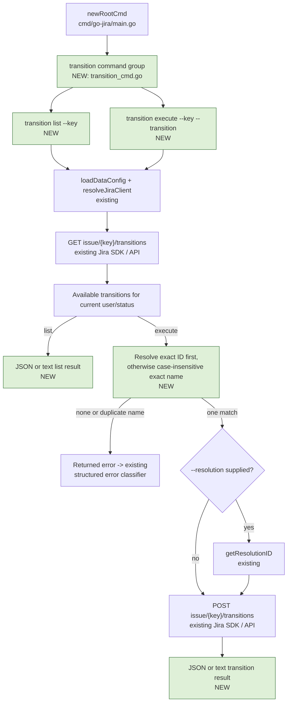

# Plan: Jira issue transitions CLI

## Goal

讓 go-jira CLI 使用者能針對單一 Jira issue 查詢目前帳號可執行的
transitions，並以 transition ID 或名稱安全地切換 issue 狀態。完成後，使用者可用
`go-jira transition list --key GAIA-123` 查看可用選項，也可用
`go-jira transition execute --key GAIA-123 --transition <ID-or-name>` 執行切換；
execute 必須先重新取得可用 transitions、完成唯一比對後才送出 POST。既有
`go-jira run --to-transition` 自動化介面及其相容行為維持不變。

## Architecture / flow



The Jira API contract used by this flow is:

- `GET /rest/api/2/issue/{issueIdOrKey}/transitions?expand=transitions.fields`
  returns the transitions currently available to the caller.
- `POST /rest/api/2/issue/{issueIdOrKey}/transitions` accepts the selected
  transition ID and returns HTTP `204 No Content` on success.
- References:
  [Jira Data Center REST API](https://docs.atlassian.com/software/jira/docs/api/REST/9.8.1/)
  and
  [Jira Cloud REST API v2](https://developer.atlassian.com/cloud/jira/platform/rest/v2/api-group-issues/).

## CLI contract

```bash
# List transitions available for the issue.
go-jira transition list --key GAIA-123

# Execute by case-insensitive exact name.
go-jira transition execute --key GAIA-123 --transition Done

# Execute by exact transition ID.
go-jira transition execute --key GAIA-123 --transition 31

# Preserve the existing optional resolution capability.
go-jira transition execute --key GAIA-123 --transition Done --resolution Fixed
```

- `transition` is a parent command in the existing `Issues` help group.
- Both leaf commands use the existing Jira/auth flags, global timeout, and
  `--output json|text` behavior.
- `list` requires `--key`.
- `execute` requires `--key` and `--transition`; `--resolution` is optional.
- The selector is matched against the freshly fetched list on every execution:
  1. An exact transition ID match wins.
  2. Otherwise, use a case-insensitive exact transition name match.
  3. No match is an error that includes the requested selector and compact
     available `ID/name` choices. No POST is sent.
  4. Multiple name matches are an ambiguity error listing the matching IDs and
     instructing the caller to use an ID. No POST is sent.
- An empty list is valid output for `list`, but makes every `execute` selector
  unavailable.
- Do not retry automatically if the workflow changes between GET and POST;
  return the Jira error so the caller can list again and decide what to do.

### Successful output

Keep stdout machine-readable by default and reserve stderr for diagnostics.

- `transition list --output json` returns an object containing the issue key
  and a `transitions` array. Each transition must expose at least `id`, `name`,
  destination status (`to`), and the transition field metadata returned by the
  SDK (`fields`).
- `transition list --output text` prints one tab-separated row per transition:
  `ID<TAB>NAME<TAB>DESTINATION_STATUS`.
- `transition execute --output json` returns a stable result containing
  `status: "transitioned"`, the issue key, selected transition ID/name, and
  destination status.
- `transition execute --output text` prints one concise line such as
  `transitioned GAIA-123 via 31 (Done) -> Done`.
- Do not emit a success result until POST returns HTTP `204`.

## Scope

### May modify

- `cmd/go-jira/transition_cmd.go` (new)
  - Cobra parent/list/execute command constructors.
  - GET/list, selector resolution, optional resolution lookup, POST/execute,
    and JSON/text result mapping.
- `cmd/go-jira/transition_cmd_test.go` (new)
  - Pure selector tests and command-level HTTP boundary tests.
- `cmd/go-jira/main.go`
  - Add the selector flag constant and register the transition parent command
    in `newRootCmd`.
- `cmd/go-jira/cli_test.go`
  - Assert the new root command is registered.
- `cmd/go-jira/schema_test.go`
  - Assert the nested `transition list` / `transition execute` tree and their
    required flags are discoverable.
- `cmd/go-jira/apiclient.go`
  - Update stale comments listing the standalone data commands; no behavior
    change is expected here.
- `README.md`, `README.zh-tw.md`, `README.zh-cn.md`
  - Document list/execute examples, ID/name matching, optional resolution, and
    output behavior while keeping the existing `run` documentation intact.
- `CHANGELOG.md`
  - Add the feature under `Unreleased`.

### Must not modify

- `cmd/go-jira/run.go`, `cmd/go-jira/transition.go`, and
  `cmd/go-jira/transition_test.go`: preserve the legacy batch transition path,
  including its current name-only matching and not-found behavior.
- `pkg/auth/`, `pkg/oauth/`, `pkg/storage/`, `pkg/broker/`, and other shared
  core packages.
- `go.mod` and `go.sum`; the pinned Jira client already exposes the required
  context-aware transitions APIs.
- The external `github.com/appleboy/go-jira-lib` fork.
- Jira workflow configuration or server-side transition screens.

If implementation proves that a must-not-modify file is required, stop and ask
before expanding scope.

## Existing patterns to follow

- Mirror `cmd/go-jira/token.go` for a parent command with executable leaf
  subcommands.
- Mirror `cmd/go-jira/get.go` and `cmd/go-jira/link.go` in each leaf:
  - register `addCommonFlags`, `addOAuthFlags`, `addAuthFlags`, and
    `addOutputFlag` on the executable leaf;
  - call `loadDataConfig` and `resolveJiraClient`;
  - use `cmdContextWithTimeout(cmd, time.Minute)`;
  - close every non-nil Jira response body;
  - wrap errors with the issue key and operation context;
  - render success through `emitResult`.
- Reuse `getResolutionID` and `jira.Issue.DoTransitionPayloadWithContext` only
  when `--resolution` is supplied; otherwise
  `jira.Issue.DoTransitionWithContext` is sufficient.
- Reuse the `httptest.Server` and `runDataCmd` harness from
  `cmd/go-jira/datacmd_test.go`; do not introduce a new mocking framework or a
  Jira-service abstraction solely for this feature.
- Let the existing root error classifier preserve structured stderr and exit
  code behavior for Jira authentication, rate-limit, and runtime failures.
- Cobra automatically exposes registered commands to help, schema traversal,
  and shell completion; no generated completion artifact is needed.

## Constraints

- No new third-party dependencies and no Jira client upgrade.
- Preserve all existing command invocations and output contracts.
- Support a single issue per standalone command; bulk text extraction remains
  the responsibility of `go-jira run`.
- Match only available transitions returned for the current issue state and
  caller. Do not POST an arbitrary user-provided ID without the GET check.
- Transition names use `strings.EqualFold` semantics; do not add substring or
  fuzzy matching.
- Arbitrary transition-screen fields are out of scope. `--resolution` is the
  only additional field supported because the repository already implements
  that lookup and payload.
- Jira API validation errors for other required transition fields must be
  returned intact rather than guessed or silently ignored. The list JSON output
  exposes `fields` so callers can diagnose such workflows.
- Missing required CLI flags remain Cobra usage errors; an unavailable or
  ambiguous transition is a runtime error because availability depends on Jira
  state.

## Verification

Baseline before implementation: `go test ./...` passes.

### Three end-to-end command tests

1. **Happy path — list and execute by both selectors**
   - Use table-driven subtests for list JSON/text, execute by exact ID, and
     execute by case-insensitive name.
   - The mock must observe
     `GET /rest/api/2/issue/GAIA-123/transitions?expand=transitions.fields`.
   - Execute must then POST to the same transitions path with
     `transition.id == "31"`; reply with HTTP `204`.
   - Assert stdout contains the issue key, transition ID/name, destination
     status, and the documented success status/line as applicable.
2. **Unavailable selector — fail before mutation**
   - GET returns an available `31/Done`, while execute requests an unknown ID or
     name.
   - Assert zero POST requests, empty stdout, a non-nil error, and an error
     message containing the requested selector plus the available `31/Done`
     choice.
3. **Jira rejects the transition — surface the API failure**
   - GET resolves the selector, then POST returns HTTP `400` with Jira's
     `Invalid transition` detail.
   - Assert stdout remains empty and the returned/classified error includes the
     issue key, HTTP status, and Jira detail. Existing structured-error tests
     continue to cover stderr envelope and exit-code rendering.

### Additional tests

- Pure selector unit tests: ID precedence, case-insensitive name, no match, and
  duplicate-name ambiguity with candidate IDs.
- `list` with an empty transitions array succeeds and emits an empty result.
- Optional `--resolution` resolves the name to an ID and includes it in the POST
  payload; an unknown resolution fails before POST.
- GET failure, POST failure, and non-204 response handling close response bodies
  and preserve context.
- Cobra rejects missing `--key` / `--transition`; schema marks them required.
- Root registration and nested schema discovery tests pass.

### Repository checks

```bash
gofmt -w <changed-go-files>
go test ./...
make lint
git diff --check
```

No stress or soak test is required: each command operates on one issue with one
GET and at most one resolution lookup plus one POST, all bounded by the existing
timeout.

### Manual verification

Against a disposable or staging Jira issue with a reversible workflow:

1. Run `transition list` in JSON and text modes and compare the choices with the
   Jira UI.
2. Execute one transition by name, verify the issue status in Jira, then list
   again.
3. Execute the reversible transition by ID and verify the status returns.
4. Request an unavailable selector and confirm the issue remains unchanged.

Production observability remains the existing CLI contract: successful result
on stdout; contextual errors through structured stderr; HTTP 401/403 and 429
retain their classified exit codes and rate-limit metadata. No metrics backend
is introduced for this leaf CLI feature.

## Done definition

- [ ] `transition list` returns currently available transitions in documented
      JSON and text formats.
- [ ] `transition execute` always validates against the fresh list and succeeds
      by exact ID or case-insensitive exact name.
- [ ] Missing, ambiguous, and Jira-rejected transitions fail without a false
      success result; pre-match failures send no POST.
- [ ] Optional `--resolution` works without adding arbitrary transition-field
      support.
- [ ] Legacy `go-jira run --to-transition` behavior remains unchanged.
- [ ] Help, `schema`, and shell completion discover both nested commands and
      required flags.
- [ ] All three end-to-end scenarios and additional unit/regression tests pass.
- [ ] `go test ./...`, `make lint`, and `git diff --check` pass.
- [ ] English, Traditional Chinese, Simplified Chinese, and Unreleased changelog
      documentation are updated.
- [ ] No changes occur outside the "May modify" list.
- [ ] The PR description includes the repository's expected AI-authorship
      disclosure and verification results.

## Risks & rollback

- **Workflow race:** the issue state or permissions can change between GET and
  POST. Do not retry; surface Jira's response and tell the caller to list again.
- **Duplicate names:** workflows may expose identical display names. Refusing an
  ambiguous name prevents moving an issue through the wrong transition; ID
  remains deterministic.
- **Required screen fields:** some workflows require fields beyond resolution.
  Expose the metadata in list output and preserve Jira's validation error rather
  than sending guessed values.
- **Output compatibility:** the new JSON/text shapes become a scripting
  contract. Cover them at command level so refactors cannot silently change
  stdout.
- **Legacy regression:** keeping standalone command code in a new file and not
  changing the existing batch processor isolates the compatibility risk.
- **Rollback:** remove the new command registration/files and revert the docs
  and tests. There is no persistent data, migration, dependency, or server-side
  configuration to roll back; any transition already executed in Jira must be
  reversed through that Jira workflow if needed.

## Open questions

- None. The command shape, ID/name support, optional resolution, compatibility
  boundary, and verification strategy were approved before this plan was
  drafted.
